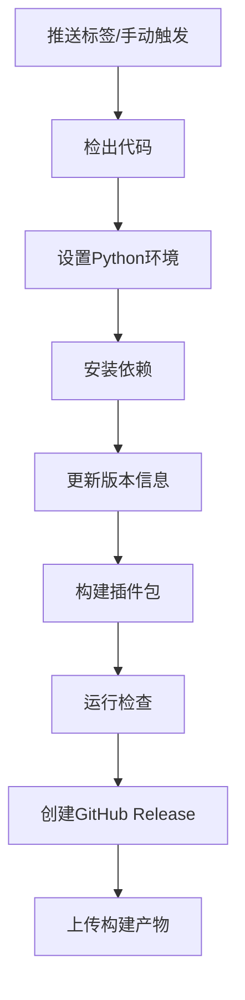

# GitHub Actions 自动化发布设置

## 🚀 自动化发布流程

本项目包含两个 GitHub Actions 工作流程，实现完全自动化的构建和发布：

### 1. 自动构建和发布 (`build-and-release.yml`)

**触发方式：**
- 推送版本标签（如 `v2.0.0`）
- 手动触发

**功能：**
- ✅ 自动构建 `.ankiaddon` 文件
- ✅ 运行发布前检查
- ✅ 创建 GitHub Release
- ✅ 上传构建产物

### 2. AnkiWeb 上传准备 (`ankiweb-upload.yml`)

**触发方式：**
- 仅手动触发

**功能：**
- ✅ 准备 AnkiWeb 兼容的包
- ✅ 生成上传指导文档
- ✅ 创建专门的 GitHub Release
- ✅ 提供详细的上传步骤

## 📋 使用方法

### 方法一：标签触发（推荐）

```bash
# 本地发布脚本（自动创建标签）
chmod +x scripts/release.sh
./scripts/release.sh 2.0.0

# 或手动创建标签
git tag v2.0.0
git push origin v2.0.0
```

### 方法二：手动触发

1. 访问 GitHub 仓库的 Actions 页面
2. 选择 "Build and Release Chat with Card" 工作流程
3. 点击 "Run workflow"
4. 输入版本号（如 `2.0.0`）
5. 点击 "Run workflow"

### 方法三：AnkiWeb 专用准备

1. 访问 GitHub 仓库的 Actions 页面
2. 选择 "Upload to AnkiWeb (Manual)" 工作流程
3. 点击 "Run workflow"
4. 输入版本号
5. 选择是否创建 GitHub Release
6. 点击 "Run workflow"

## 🔧 工作流程详情

### 自动构建流程



### 生成的文件

每次构建会生成：
- 📦 `chat-with-card-v{version}-{timestamp}.ankiaddon` - 主插件包
- 📖 `INSTALLATION_GUIDE_{timestamp}.html` - 安装指南
- 📋 `RELEASE_INFO_{timestamp}.md` - 发布信息
- 📤 `ANKIWEB_UPLOAD_INSTRUCTIONS.md` - AnkiWeb上传指导

## 🌐 AnkiWeb 上传流程

### 自动化部分
1. ✅ 构建符合AnkiWeb标准的包
2. ✅ 验证包结构和依赖
3. ✅ 生成上传指导文档
4. ✅ 创建GitHub Release

### 手动部分（AnkiWeb限制）
1. 📥 下载生成的 `.ankiaddon` 文件
2. 🌐 访问 https://ankiweb.net/shared/addons/
3. 📤 点击 "Upload" 按钮上传文件
4. 📝 填写插件信息（使用生成的模板）
5. ✅ 提交审核

## 🔐 权限设置

GitHub Actions 使用内置的 `GITHUB_TOKEN`，无需额外配置。

确保仓库设置中启用了：
- ✅ Actions 权限
- ✅ 写入权限（用于创建 Release）

## 📊 监控和调试

### 查看构建状态
- 访问仓库的 Actions 页面
- 查看工作流程运行历史
- 检查构建日志

### 常见问题
1. **构建失败**：检查 Python 依赖和代码语法
2. **检查失败**：验证包结构和 manifest.json
3. **上传失败**：确保 GitHub 权限正确

## 🎯 最佳实践

### 版本管理
- 使用语义化版本号（如 `2.0.0`）
- 每个版本创建对应的 Git 标签
- 在 `manifest.json` 中保持版本同步

### 发布流程
1. 🔍 本地测试和验证
2. 📝 更新版本号和发布说明
3. 🏷️ 创建版本标签
4. 🚀 推送触发自动构建
5. 📤 下载并上传到 AnkiWeb

### 质量保证
- ✅ 每次发布前运行完整检查
- ✅ 在干净的 Anki 环境中测试
- ✅ 验证多语言功能
- ✅ 检查依赖完整性

## 🔄 更新工作流程

如需修改自动化流程：
1. 编辑 `.github/workflows/` 中的 YAML 文件
2. 提交更改到主分支
3. 下次触发时使用新的工作流程

---

通过这套自动化流程，您只需要推送一个版本标签，就能获得完整的发布包和详细的上传指导！
